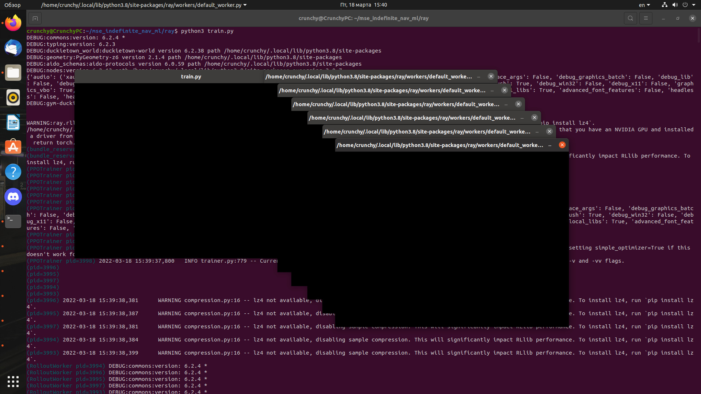

# Wrappers

Wrapper - класс-обёртка над классом Env[ObsType, ActType], позволяющий вносить изменения в поведение среды
(Env - класс, инкапсулирующий среду, а также позволяющий частично или полностью её наблюдать) без изменения основного кода.

Wrapper является базовым классом для всех обёрток, которые могут при необходимости перегружать методы Wrapper.
Основными наследниками, определёнными в файле core.py (gym) являются:
- ObservationWrapper
- RewardWrapper
- ActionWrapper
У этих классов также есть наследующие классы.

## Примеры обёрток

- ObservationWrapper:
	Перегружает методы reset и step класса Wrapper, а также определяет абстрактный метод observation.
	Позволяет вести наблюдение за средой.
- ResizeObservation:
	Перегружает конструктор класса и метод observation родительского класса - ObservationWrapper.
	Сводит изображение к квадратному формату.
- DiscreteWrapper:
	Также перегружает конструктор и два абстрактных метода класса ActionWrapper - action и reverse_action.
	Дискретизирует действия в среде вместо использования непрерывного контроля
	(множество движений дискретизируется, количество возможных движений конечно).

## Инструкция по запуску обучения в gym_duckietown

Для запуска обучения нужно выполнить код в train.py (ветка ray) следующей командой из директории ray:

```
python3 train.py
```

Процесс обучения:

<p align="center">
<br>
</p>

Можно выбрать другую карту (выбираются карты, содержащиеся в директории PythonXX/site-packages/duckietown_world/data/gd1/maps), указав в конфигурации в train.py её название:

<p align="center">
<br>
</p>